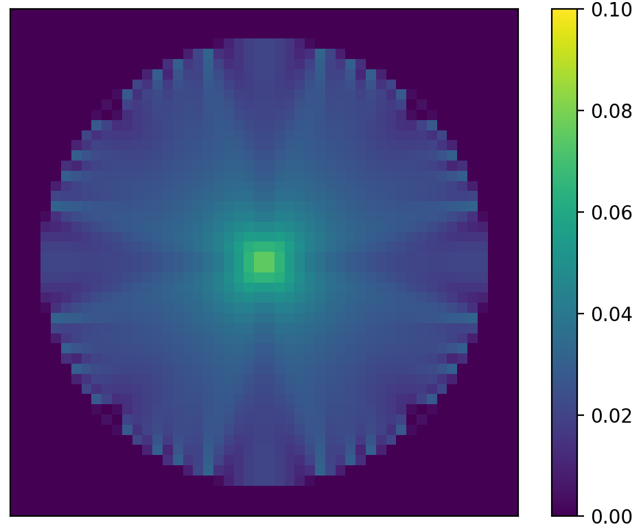
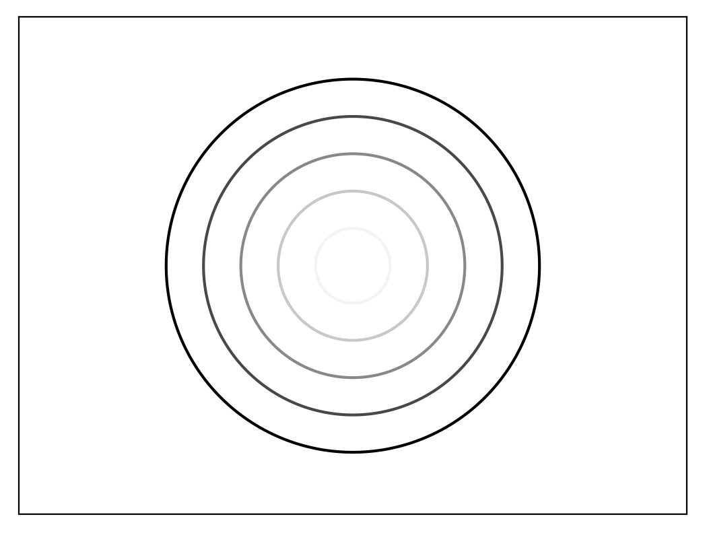
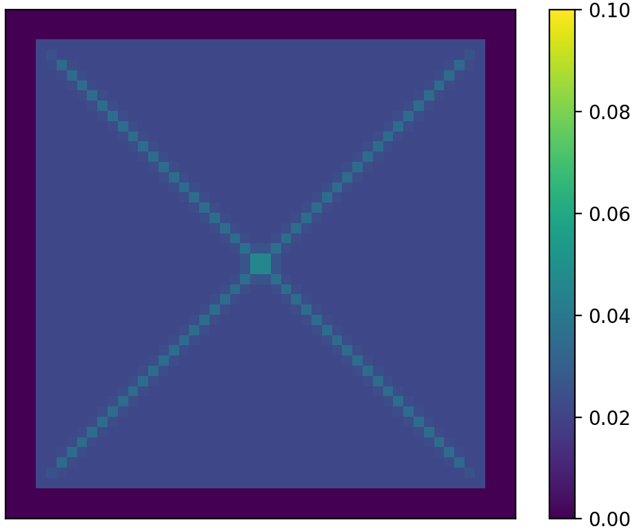
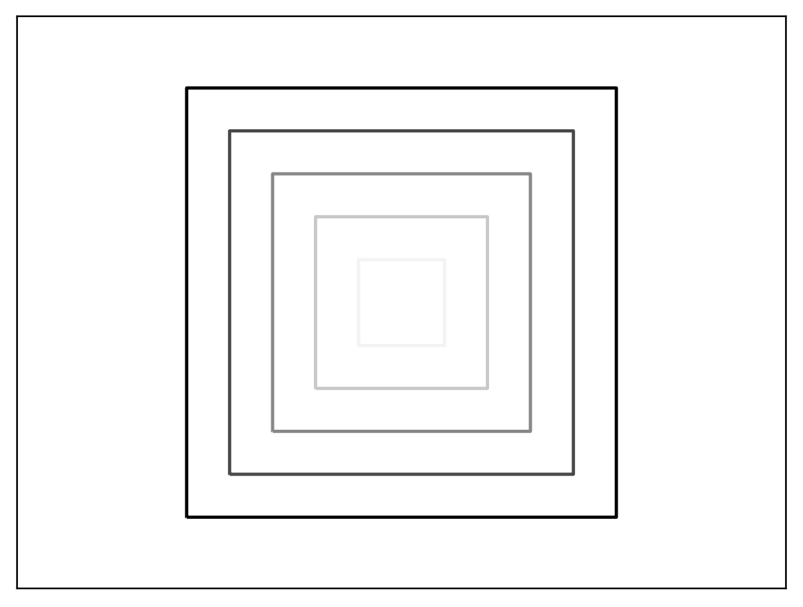
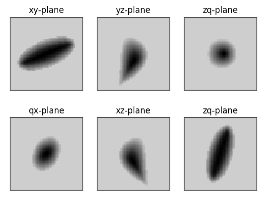
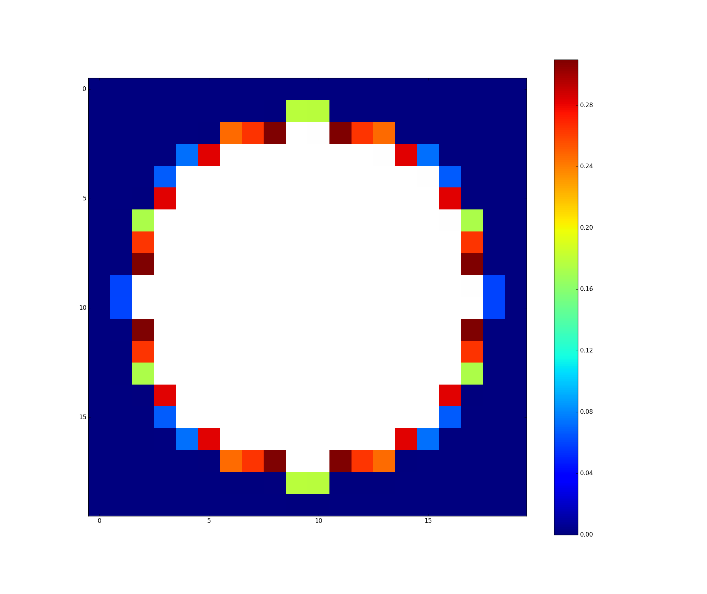

[Back to front page](./)

# Eikonal images

All the below simulations are using 50 grid points in each dimension.

 

Error and exact solution when the boundary is a 4-dimensional sphere.

 

Error and exact solution when the boundary is a 4-dimensional box.

Computed solution when the boundary is dU.

Values after the initialization of the grid.

