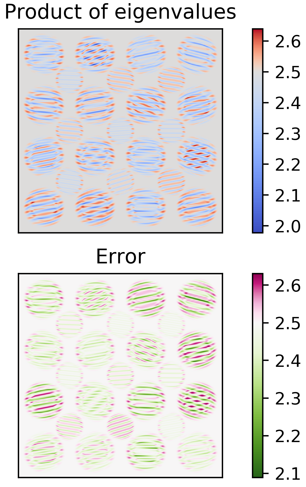

[Back to front page](./)

# Wild solution images

Eigenvalue product and error after one and two steps.

Interfering plane waves causing negative eigenvalues.

Streamlines after one step.

Streamlines after 7 steps

Curl after each step.
